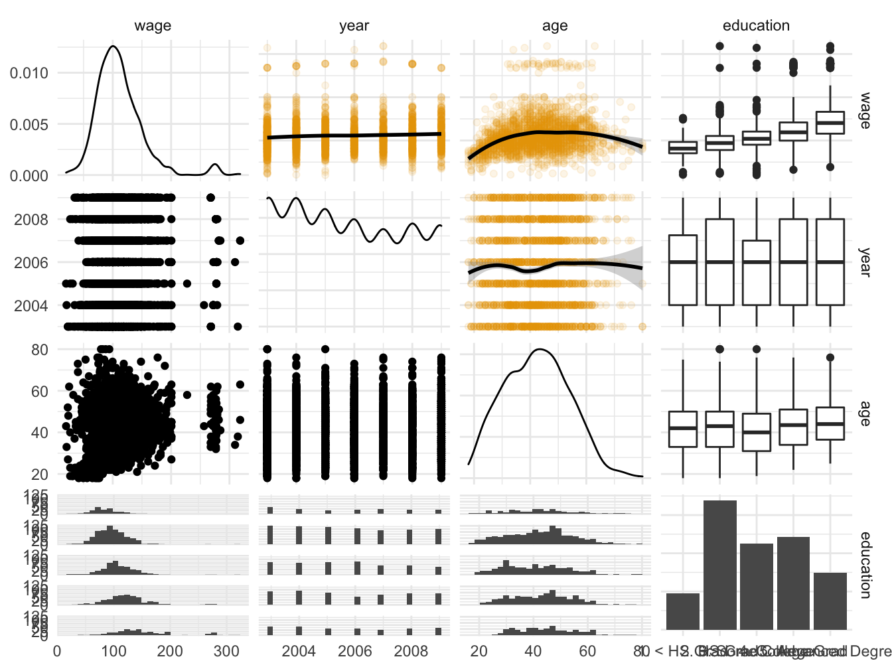
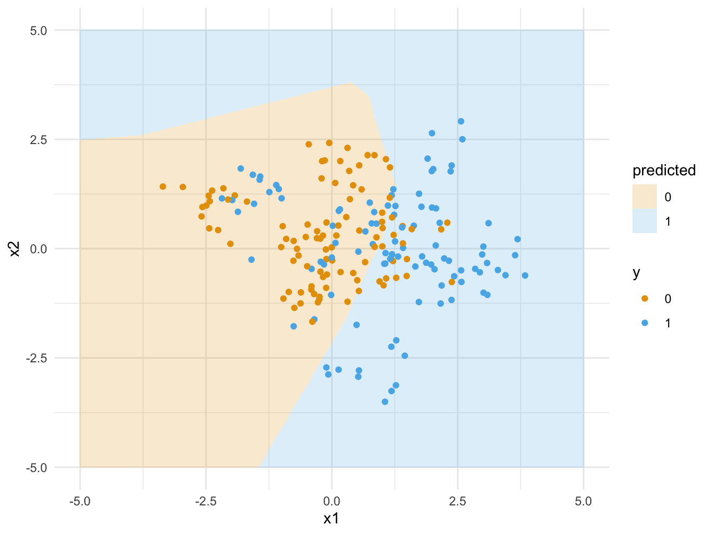

# Beyond linearity (draft)

In this chapter we discuss some non-linear models. The purpose is only to give a short introduction to each model, enough to be able to use it in practice.

Readings for this chapter is:
ISL 7.5, 7.7

This [video series](https://www.youtube.com/playlist?list=PLZHQObOWTQDNU6R1_67000Dx_ZCJB-3pi) on neural networks

## Smoothing splines

For smoothing splines, the hypothesis set is the functions with two continuous derivatives, $C^2$. The optimization problem that it solves is
$$
\min_{h\in C^2} \sum_{i=1}^n\left( y_i - h(x_i) \right)^2 + \lambda \int h''(t)^2dt.
$$
The second term penalizes variability in $h$. Note that there are no parameters in this model and so it is a little surprising that the solutions can be easily characterized. It turns out that the optimal $h$ is a piecewise cubic polynomial with knots at $x_1,\ldots x_n$ and continuous first and second derivatives. The parameter $\lambda$ is usually determined by CV. Instead of $\lambda$ the penalty parameters is sometimes reparametrized as degrees of freedom, which has a similar interpretation as in linear regression.

Let us apply this in an example.

```r
library(caret)
```

```
## Loading required package: lattice
```

```
## Loading required package: ggplot2
```

```r
library(ISLR)

data("Wage", package = "ISLR")
Wage <- na.omit(Wage)

set.seed(42)
training.samples <- createDataPartition(Wage$wage, p = 0.8, list = FALSE)
train.data  <- Wage[training.samples, ]
test.data <- Wage[-training.samples, ]

smooth <- smooth.spline(train.data$age,train.data$wage, cv = TRUE)

predictions <- predict(smooth, test.data$age)
mean((predictions$y - test.data$wage)^2)
```

```
## [1] 1553.058
```
<div class="figure" style="text-align: center">

<p class="caption">(\#fig:smoothingSpline)Smoothing spline fit to wage date</p>
</div>

## Generalized additive models

If there is more than one predictor, a useful model is the Generalized additive models (GAM). They are defined by the hypothesis functions of the form
$$
h(x_i) = \beta_0 + \sum_{j=1}^p h_j(x_{ij}).
$$
Here $h_j$ can be in principle any function, for example smoothing splines. We now present a small example using the wage data from ISLR. First load the data, partition into training/test and plot.

```r
library(ISLR)
library(gam)
```

```
## Loading required package: splines
```

```
## Loading required package: foreach
```

```
## Loaded gam 1.20
```

```r
library(GGally)
```

```
## Registered S3 method overwritten by 'GGally':
##   method from   
##   +.gg   ggplot2
```

```r
data("Wage", package = "ISLR")
Wage <- na.omit(Wage)

set.seed(42)
training.samples <-
  createDataPartition(Wage$wage, p = 0.8, list = FALSE)
train.data  <- Wage[training.samples,]
test.data <- Wage[-training.samples,]
cbp1 <- c("#999999", "#E69F00", "#56B4E9", "#009E73",
          "#F0E442", "#0072B2", "#D55E00", "#CC79A7")

ggpairs(train.data, columns=c("wage","year","age","education"),
        upper=list(continuous=wrap("smooth_loess",alpha=0.1,color=cbp1[2])),
        lower=list(continuous=wrap("smooth_loess",alpha=0.1,color=cbp1[2]))) +
  theme_minimal()
```

```
## `stat_bin()` using `bins = 30`. Pick better value with `binwidth`.
```

```
## `stat_bin()` using `bins = 30`. Pick better value with `binwidth`.
## `stat_bin()` using `bins = 30`. Pick better value with `binwidth`.
```

<div class="figure" style="text-align: center">

<p class="caption">(\#fig:wageDataPlot)Scatter plot matrix of wage data.</p>
</div>
Looking at first row, for the year variable it would probably be fine with a linear fit, while for the age variable, a linear fit seems doubtful. Let us fit two models, one which is linear in year and one with a smoothing spline in year. Both are smoothing splines in age.

```r
gam.m1 <- gam(wage~ year + s(age , 4) + education , data = Wage)
gam.m2 <- gam(wage~ s(year , 4) + s(age , 4) + education , data = Wage)

anova(gam.m1, gam.m2)
```

```
## Analysis of Deviance Table
## 
## Model 1: wage ~ year + s(age, 4) + education
## Model 2: wage ~ s(year, 4) + s(age, 4) + education
##   Resid. Df Resid. Dev Df Deviance Pr(>Chi)
## 1      2990    3696846                     
## 2      2987    3692824  3   4021.7   0.3542
```
The p-value indicates that the linear fit is satisfactory. Let us calculate the test error, also comparing to a linear model.

```r
ls <- lm(wage~ year + age + education , data = Wage)
predictions <- predict(ls, test.data )
mean((predictions - test.data$wage)^2)
```

```
## [1] 1248.707
```

```r
predictions <- predict(gam.m1, test.data )
mean((predictions - test.data$wage)^2)
```

```
## [1] 1174.914
```

```r
predictions <- predict(gam.m2, test.data )
mean((predictions - test.data$wage)^2)
```

```
## [1] 1170.57
```
The gam models outperform the linear model. The test error is smaller for the gam model with year as smoothed spline, although the difference is small.

## Neural networks

In this section we give a short introduction to (artificial) neural networks (NN). After reading this you should know enough to understand enough to implement a simple NN and be able to learn about more advanced models on your own.

Let us consider the classification setting, the regression setting is very similar. We have a set of predictors $x_1,\ldots, x_p$ and wish to classify into one of $K$ classes. Consider the following simple model:
\begin{align*}
a &= \sigma(Wx + b)\\
h &= \text{softmax}(a).
\end{align*}
Here $W\in \mathbb R^{K\times p}$ is a weight matrix, $b\in \mathbb R^K$ is a bias vector and $\sigma$ is called the activation function. Traditionally sigmoid functions (s-shaped) were used as activiation function but recently it is more populare to use the so called rectified linear unit (ReLU), which is
$$
\sigma(x) = \max(0,x).
$$
Since we are doing classification, it is convenient if the output of the network can be interpreted as the probability of each class, this is the purporse of the softmax function:
$$
\text{softmax}(x) := \frac{e^{x_i}}{\sum_{j=1}^K e^{x_j}},\text{ for } i=1,\ldots,K \text{ and } x=(x_1,\ldots , x_K).
$$
We then classify each observation into the class with the highest probability.

The function above, $\sigma(Wx + b)$ is called a layer, and now we can stack them on to each other,
\begin{align*}
a_1 &= \sigma(W^1 x + b^1)\\
a_2 &= \sigma(W^2 a_1 + b^2)\\
&\vdots \\
a_L&= \sigma(W^{L-1} a_{L-1} + b^{L-1}) \\
h &= \text{softmax}(a_L).
\end{align*}
That is essentially all there is, different networks can be obtained by choosing different types of weight matrices and different number of layers $L$. There are results that show that NNs can approximate essentially any function. So looking back at our discussion about generalization error, it is not surprising that it is possible to achieve a low in-sample error using NN. What is however surprising, given the large number of parameters, is that they many times also achieve a low out-of-sample error.

As an example, let us consider the same data set as in Section 4.2. We do classification with 1, 2 and 3 layer NNs and plot the result.

<div class="figure" style="text-align: center">

<p class="caption">(\#fig:NN1layer)Training data and classification with 1 layer neural network</p>
</div>
<div class="figure" style="text-align: center">

<p class="caption">(\#fig:NN2layer)Training data and classification with 2 layer neural network</p>
</div>
<div class="figure" style="text-align: center">

<p class="caption">(\#fig:NN3layer)Training data and classification with 3 layer neural network</p>
</div>

What remains to discuss is how to train NNs.

## Stochastic gradient descent

In this section we discuss an optimization method called *stochastic gradient descent*, which is used in training, among other models, NNs.

However, first let us consider (vanilla) gradient descent. We have a function $f$, which in general would be a function from $\mathbb R^d$ to $\mathbb R$, but for simplicity let us say it is from $\mathbb R$ to $\mathbb R$. We would like to minimize this function, that is we want to find $\theta^\star$ such that $f(\theta^\star)\leq f(\theta)$, for any $\theta\in \mathbb R$. Gradient descent is the algorithm that iterates the update:
$$
\theta_{new} = \theta_{old} - \eta f'(\theta_{old}).
$$
The algorithm calculates $f'$ evaluated at the current point $\theta_{old}$. If this is positive, the function is sloping upwards at that point and so if we take a small step to the left, the function should decrease. Therefore we take a step in the direction opposite of the sign of $f'$. Of course, this is only true close to $\theta_{old}$ so if we take a too large step, we risk increasing the function. Therefore we multiply by a small number $\eta>0$, usually called *learning rate* in machine learning. The choice of the learning rate is crucial, too small and the algorithm will be slow to find the minimum, too big and it might not find it at all. One can write done conditions when gradient descent is guaranteed to converge to the correct value, however in machine learning these conditions are rarely fullfilled. So instead one simply evaluate the model given by the algorithm, and if it works well, one is happy.

As a toy example, let us implement gradient descent on the function $f(\theta) = \theta^2$, were clearly $\theta^\star = 0$.

<div class="figure" style="text-align: center">

<p class="caption">(\#fig:gradientDescentExample)Gradient descent</p>
</div>
We see that the fastest convergence (of these choices) is $\eta = 0.1$. Making $\eta$ smaller gives slower convergence since the step size is smaller, making $\eta$ larger makes the step size to large so that the algorithm overshoots and $\theta$ becomes negative.

In statistics we often want to minimize (or maximize) functions of the form
$$
f(\theta) = \frac{1}{n} \sum_{i=1}^n f_i(\theta),
$$
and then of course
$$
f'(\theta) = \frac{1}{n} \sum_{i=1}^n f_i'(\theta).
$$
Both the log-likelihood and the in-sample error are of this form. If $n$ is large, to calculation of the sum will however be expensive. Stochastic gradient descent therefore samples a small number of terms from the sum and takes a gradient descent step based on the derivative of only those terms. These terms are called a *mini-batch* and the number of terms is the batch size. Then we choose a number of different terms from the sum, and take a step based on them. Once we have gone through all the $n$ terms, we have completed one *epoch*.

The only thing that remains is to discuss how the derivatives are calculated. The parameters that we need to differentiate with respect to are the weight matrices $W$ and the biases $b$. Doing the differentiation by hand is too complicated and not an option.

The composition of two functions $f_1$ and $f_2$ is the function $f_1(f_2(x))$. Note that the neural network is of this form, where a linear transformation is composed with the activation function, which forms a layer. That layer is then composed with the next layer, and so on. Calculating derivatives of composed functions can be done with the chain rule and in the context of neural networks this is known as backpropagation.

For more on backpropogation and a visualization of neural network, I recommend this [video series](https://www.youtube.com/playlist?list=PLZHQObOWTQDNU6R1_67000Dx_ZCJB-3pi).

## An application

Let us see an example of how to implement a neural network classifier. We will use Keras, which is just a wrapper for the machine learning library Tensorflow. You may find the [documentation](https://keras.rstudio.com) useful

Our goal is to classify hand-written digits from the MNIST database, which is conveniently included in Keras. The first time you install Keras, you do.

```r
install.packages("keras")
keras::install_keras(tensorflow = "cpu")
```
After that, it should be enough to

```r
library(keras)
```
The MNIST database is already divided in a training and a test set

```r
mnist <- dataset_mnist()

x_train <- mnist$train$x
y_train <- mnist$train$y
x_test <- mnist$test$x
y_test <- mnist$test$y
```
Let us see what the pictures look like.
<div class="figure" style="text-align: center">

<p class="caption">(\#fig:mnist1)Examples from MNIST</p>
</div>
Each image is represented as a 28x28 matrix of pixel values between 0 and 255. We reshape each matrix in to a vector and scale the pixel value so that it is between 0 and 1.

```r
dim(x_train) <- c(nrow(x_train), 784)
dim(x_test) <- c(nrow(x_test), 784)

x_train <- x_train / 255
x_test <- x_test / 255
```
The $y$ variables are given as an integer between 0 and 9. We transform it to a vector of dummy variables.

```r
y_train <- to_categorical(y_train, 10)
y_test <- to_categorical(y_test, 10)
```
Now we specify a 2-layer NN with Relu activation in the hidden layer and softmax in the last layer.

```r
model <- keras_model_sequential()
model %>%
  layer_dense(units = 50, activation = "relu", input_shape = c(784)) %>%
  layer_dense(units = 10, activation = "softmax")
```
We compile the model by specifying the loss and the optimization method.

```r
model %>% compile(
  loss = "categorical_crossentropy",
  optimizer = optimizer_rmsprop(),
  metrics = c("accuracy")
)
```
Here, cross entropy loss is just the negative of a multinomial log likelihood. The optimizer, RMSprop, is a way of choosing the learning rate adaptively. Now we train the NN.

```r
history <- model %>% fit(
  x_train, y_train,
  epochs = 10, batch_size = 128,
  validation_split = 0.2
)
```
Here we use 20‰ as a validation set. Usually NN does not include a regularization term and so there is a risk of overfitting. Instead one usually restricts the number of epochs and the optimization algorithm is not run until convergence. This is called early stopping.

```
## `geom_smooth()` using formula 'y ~ x'
```

<div class="figure" style="text-align: center">

<p class="caption">(\#fig:mnistHistory)Training and validation loss/accuracy for each epoch</p>
</div>
We see that the validation accuracy is still increasing, so we could probably run more epochs. Let us evaluate the model on the test set.

```r
model %>% evaluate(x_test, y_test,verbose = 0)
```

```
##      loss  accuracy 
## 0.1069675 0.9687000
```
The accuracy is 97%, which is not too bad. Let us make predictions on the test set and plot some of them.
<div class="figure" style="text-align: center">

<p class="caption">(\#fig:mnist2)Predictions on the test set</p>
</div>


